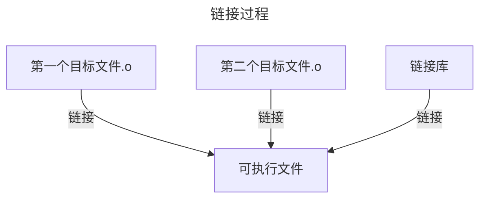

# 编译和链接


## 1. 预处理-E(大写)

```c
//比如
#include<stdio.h>   //预处理后会把stdio.h的所有内容替换这个包含
#define a 100       //预处理后会把以后的所有a全部替换为100
```

==**用`gcc`编译器查看预处理指令情况**==

```cmd
gcc -E  path/name.c -o ouputfile.i
#指令每次只能预处理单个文件
```

附

```
#编译阶段选项：
-E：仅进行预处理，不进行编译、汇编或链接。预处理会展开头文件、宏等。(!大写-E)
-S：进行编译，但不进行汇编或链接，生成汇编代码。                 (!大写-S)   
-c：进行汇编，但不进行链接，生成目标文件（.o 文件）。			(小写-c)
-o <file>：将输出放置到 <file> 中，可以是预处理后的文件、汇编文件、目标文件或可执行文件 (ESc iso)
```


> [!note]
>
> - ==如果头文件里面包含其他头文件,这个包含的头文件也会被替代,即**递归进行**==

## 2.编译-S(大写)

```cmd
gcc -S test.i -o test.s  #将C语言代码转换为汇编代码(大写-S)
#也只能处理单个文件
```


## 3.汇编-c(小写)

```cmd
gcc ./test.s -o ./test.o -c #由汇编代码得到二进制文件
```


> [!important]
>
> ==汇编过程每一个.c源文件都会形成一个目标文件和相应的符号表(记录全局变量名,函数名等符号名的作用),链接过程会合并和重定位所有的符号表==




## 4.链接


```cmd
gcc file_1.o file_2.o -o outputFile
```

```cmd
#一条指令完成预处理编译汇编链接
gcc file1.c file2.c -o output
```

> [!warning]
>
> - **==预处理编译汇编每次只能处理一个文件,如果有多个文件需要分别处理得到目标文件.o在链接成可执行文件,这是因为-o生成文件每次只能生成一个文件==**
>
> - 预处理编译汇编过程只能单个文件编译,但是可以从某一个过程直接跳跃到链接:
>
> 	```cmd
> 	gcc file1.i file2.i -o output
> 	#因为链接后只生成一个文件,预处理编译汇编过程同时处理多个文件需要生成多个文件与-o一次只能生成一个文件矛盾了!
> 	```
>
> 	


```cmd
#保留中间文件编译指令:
gcc file.c -o file -save-temps
```


## 补充

### 编码问题

- 编程环境通常的用的字符字符编码是UTF-(chcp 65001)

- 而在Windows系统中字符编码是GBK(chcp 936)

	两种格式不一样导致乱码 

> [!note]
>
> 解决方法
>
> 1. 把编程环境改为GBK编码形式
>
> 2. 把Windows终端改为UTF-8编码格式
>
> 3. 指令形式编译,再编译过程加入字符编码处理
>
> 	```cmd
> 	gcc test.c -finput-charset=utf-8 -fexec-charset=gbk  #charsets是字符集的意思
> 	```
>
> 	


