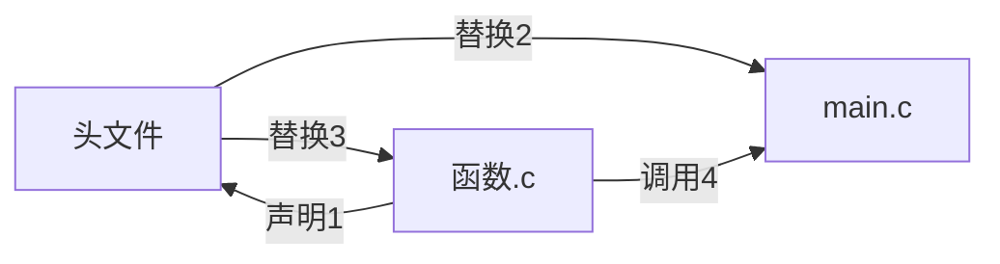

# 函数

- **尽可能高内聚低耦合**
	- 高内聚
	
		指一个函数内部的各个组成部分之间联系紧密，它们为了实现一个单一、明确的功能而协同工作。在C语言中，一个高内聚的函数通常专注于完成一项特定任务
	
	- 低耦合
	
		意味着函数与外部其他模块（如其他函数、数据结构等）之间的相互依赖程度低。在C语言中，尽量减少函数对外部变量的依赖，避免函数间不必要的数据共享或复杂的调用关系，可实现低耦合

## 函数调用的方式

### 传值调用

传值调用不会改变原变量的值,只是把实参的值传递给函数的形参,存储在形参的局部变量里面

```c
#include<stdio.h>
void fun(int x,int y)
{
    int z=int x;
	x=y;
    y=z;
}
int main()
{
	int a=20,b=10;
    printf("%d %d\n",a,b);
    fun(a,b);
    printf("%d %d\n",a,b);
}
```

交换两个数的函数,但是实际上输出没有交换两个数,因为只是把实参的值传递给形参==(传值不传址)==

### 传址调用

把变量的地址传递给形参,在函数体中对地址运算,比如说解引用运算符:`*`把变量地址解析为内存地址里存储的值,在改变变量的值达到目的


## 函数形参为数组时

函数如果形参是一个数组，在传递形参是时候参数传递的是一个地址:

```c
int fun(int* arr);
int fun(int arr[]);//两种形式等价,函数参数是数组的时候退化为指针
```

`void fun(int arr[]);`如果在函数内部用`sizeof(arr)/sizeof(arr[0])`计算得到的不是数组的长度，而是`sizeof[&arr[0]]/sizeof[arr[0]]`，数组在函数中传参退化为首元素的地址.

> [!note]
>
> 一般来说需要传数组长度为参数(如果不在函数内部循环求数组长度),因为`sizeof`在函数内计算的是指针的大小,数组名退化为首元素的地址,**==但是字符数组比较特殊,可以用`strlen`计算数组长度,不需要额外传参==**

注意:这里是形参填`int arr[]`或者`int *arr`,实际调用函数的时候用传递实参传递数组不能写`arr[]`,因为这个时候数组不是定义,数组只有定义地方时候采用`arr[ ]`表示数组,其他地方用数组名表示,所以传参传的是`arr`


## 自定义函数

### 调用和定义

- 嵌套调用:在其他函数内部调用函数,只要在调用之前有声明或者定义完函数就可以使用，包括在其他函数的定义中(比如主函数也是函数,自定义函数在main之前声明了就可以在main中使用)  调用函数之前一定要留意是不是已经声明过函数了，否则编译报错.

- 函数不允许嵌套定义,所有函数都是平行的关系,不允许在其他函数内部定义其他函数,包括main函数.
- 函数允许链式访问:前一个函数的返回值作为下一个函数的参数,但是要注意是否有返回值以及返回值个数和类型.

- 函数的声明与定义

	语言自定义函数可以放置在不同的C语言文件中，实现模块化编程

	对应某一个函数的定义可以放置在`function.c`文件中,再引入头文件`function.h`

	最后只需在`main.c`文件引头文件`include"function.h"`即可实现多文件编译

	更方便的是一个头文件可以引入多个函数,从而在`main.c`文件中只需一行可以实现声明多个函数（C语言调用库函数时候只需包含一个头文件就可以调用多个库函数）

	 ```c
	 #include"fun.h"
	 int main()
	 {
	 	return 0;
	 }              //main函数
	 ```
	
	```c
	int fun(int x);  //fun.h头文件声明函数
	```
	
	```c
	int fun(int x)
	{
	    函数体;
	}          //函数的定义
	```
	

实际上头文件的作用相当于一个宏,将`main.c`文件中引入头文件的那句话全部替换为头文件的内容函数的定义放在函数的源文件再在`main.c`文件中引入头文件,编译的时候就会把`#include"头文件.h"`替换为头文件的所有内容（可以夹带私货，多个函数的声明、库函数的头文件`#include<stdio.h>`在一个头文件里面一起替换）
	
如果函数A在函数B定义的时候被调用，则此时在B函数的源文件一个加上函数A的声明,但是为了同一格式和方便管理，我们通常会在B函数的源文件上面加上`#include"B函数.h"`然后在B的头文件上面声明函数A，因为`#include"B函数.h"`相当于一个宏.

**==包含了头文件的时候,头文件的内容会完全的替换`#include"头文件.h"`(相当于宏)==**

实际上多文件编译和自定义函数调用不是一定需要头文件,在`main.c`开头声明其他文件的自定义函数也可以正常调用函数,引头文件为了**更方便管理和查看**,比如将所有的调用库函数的头文件,定义的宏都写在自定义的头文件内,在`main.c`函数中只需包含头文件即可,不用写一大堆库函数的头文件  [多文件编译](# 多文件编译)

**便于代码维护:**如果需要修改函数的原型（如返回类型、参数列表等），只需要在头文件中修改函数声明，所有包含该头文件的源文件都会使用新的函数原型。这样可以避免在多个源文件中分别修改函数声明而可能导致的错误。




## 函数递归

> 核心思想:大事化小,把一件事化为一个类型的子问题,把⼀个⼤型复杂问题层层转化**为⼀个与原问题相似，但规模较⼩的⼦问题来求解**；直到⼦问题不能再被拆分，递归就结束了。所以递归的思考⽅式就是把⼤事化⼩的过程。递归中的递就是递推的意思，归就是回归的意思

举例:顺序打印整数的每一位数字:
比如说顺序打印1234,我们可以考虑先打印123,再打印4,然后123继续拆分12和3,最后拆到1不能再拆结束递推,开始回归,

```c
#include<stdio.h>

void print(num);
int main()
{
    int num;
    scanf("%d",&num);
    print(num);
    return 0;
}

void print(num)
{
    if(num<=9) printf("%d ",num);
    else
    {
        print(num/10);
        printf("%d ",num%10);
    }
}
```

在利用递归的时候,需要满足两个条件

- 递归存在限制条件，当满⾜这个限制条件的时候，递归便不再继续
- 每次递归调⽤之后越来越接近这个限制条件

把一个问题拆除相似的问题求解的时候在函数定义内部使用这个函数,这个时候我们需要认为这个函数可以完成任务,比如说上面代码17行,由于print是顺序打印数位,所以我们调用函数print(num/10)也就可以打印123,然后再打印4即可

> [!tip]
>
> 这样递归相当于数列递推,只要初始条件和递推满足就可以实现目的


## 多文件编译

C语言是模块化编程语言,可以将不同作用的文件分开,在不同文件中,最后再一起编译

> ==实现==
> C语言允许多文件编译,比如说把函数定义放在另一个文件中,只需要在其他源文件中声明了这里函数就可以调用这个函数
>
> 此外习惯上把标准库的包含,宏的定义放在自定义头文件中,只需在其他源文件里面包含这个自定义头文件`#include<headfile.h>`,在进行预处理的时候就会替换头文件,展开宏([编译和链接](C:\Users\Dell\Desktop\MarkDownNotes\C语言Notes\GCC编译原理\编译和链接.md))

## 函数返回值

返回值类型与定义的类型相同,比较特别的是**void类型的函数return ;也合法,可以提前终止函数,**在递归中很有用