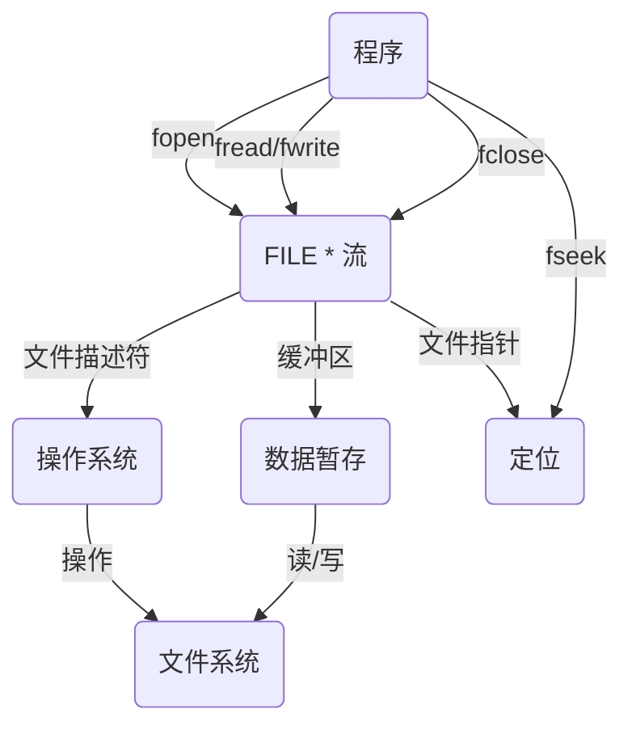

# 文件

## 什么是文件

具有某种特定格式（一般以后缀名形式表示。如：`.txt`、`.png`，也可为空）、其中存储文本或二进制信息并存储在长期存储设备或临时存储设备中的一段数据流

### 程序文件

程序⽂件包括源程序⽂件（后缀为`.c`）,⽬标⽂件（`windows`环境后缀为`.obj`）,可执⾏程序（`windows`环境后缀为`.exe`）

### 数据文件

⽂件的内容不⼀定是程序，⽽是程序运⾏时读写的数据，⽐如程序运⾏需要从中读取数据的⽂件，或者输出内容的⽂件

### 文件名

⼀个⽂件要有⼀个唯⼀的⽂件标识，以便⽤⼾识别和引⽤

⽂件名包含3部分：⽂件路径+⽂件名主⼲+⽂件后缀

比如: `C:/test/test.c`

### 二进制文件和文本文件


## 为什么使用文件

如果没有⽂件，我们写的程序的数据是存储在电脑的内存中，如果程序退出，内存回收，数据就丢失了，等再次运⾏程序，是看不到上次程序的数据的，如果要将数据进⾏持久化的保存，我们可以使⽤⽂件

# 文件打开与关闭

## 流与标准流

### 流

我们程序的数据需要输出到各种外部设备，也需要从外部设备获取数据，不同的外部设备的输⼊输出操作各不相同，为了⽅便程序员对各种设备进⾏⽅便的操作，我们抽象出了流的概念，我们可以把流想象成流淌着字符的河

C程序针对⽂件、画⾯、键盘等的数据输⼊输出操作都是通过流操作的。⼀般情况下，我们要想向流⾥写数据，或者从流中读取数据，都是要打开流，然后操作




### 标准流


> `fclose(stdin)` `fclose(stdout)`关闭标准输入输出流后发现`printf`,`scanf`等标准输入输出函数无法在终端写入和输出,因为关闭了标准输入流和标准输出流

## 文件指针

每个被使⽤的⽂件都在内存中开辟了⼀个相应的⽂件信息区，⽤来存放⽂件的相关信息（如⽂件的名字，⽂件状态及⽂件当前的位置等）。这些信息是保存在⼀个结构体变量中的。该结构体类型是由系统声明的，取名 `FILE`.


## 	文件打开与关闭

⽂件在读写之前应该先打开⽂件，在使⽤结束之后应该关闭⽂件。

在编写程序的时候，在打开⽂件的同时，都会返回⼀个`FILE*`的指针变量指向该⽂件，也相当于建⽴了指针和⽂件的关系(用文件指针`FILE*`维护打开的文件,比如记录文件打开的模式,当前指针指向的文件的文本…)

ANSI C 规定使⽤ `fopen `函数来打开⽂件， `fclose`来关闭⽂件

### `fopen`

```c
//打开文件,文件名可以填相对路径或者绝对路径
FILE * fopen ( const char * filename, const char * mode );
```


```c
//示例
#include<stdio.h>

int main()
{
    FILE *fp=fopen("test.txt","r"); //只读方式打开文件test.txt
    if(fp==NULL)
    {
        perror("fopen");
        return 1;
    }
    //文件读
    
    fclose(fp);
    return 0;
}
```


### `fclose`

```c
int fclose(FILE *stream);
```


# 文件的顺序读写


## `fgetc`

```c
int fgetc(FILE *stream);
```


## `fputc`

```c
int fputc(FILE *stream);
```


## `feof` & `ferror`

```c
int feof(FILE *stream);  //检测stream指针指向的流是否遇到⽂件末尾
int ferror(FILE *stream); //检测stream指针指向的流是否发⽣读/写错误
```


> [!tip]
>
> 使用`feof`和`ferror`通常判断文件读或者写结束是由于到达文件末尾EOF还是读写错误导致的
>
> ```c
> if(feof(fp)) puts("正常结束");
> else if(ferror(fp)) puts("读取错误"));
> ```
>
> 避免使用`while(!feof(fp))`这个条件判断是否到达文件末尾,因为需要先读写到达文件末尾才会设置FILE相关信息,然后才能用`feof`检查到达文件末尾,如果直接放在条件判断的位置会多执行一次循环,可能出错(到达文件末尾前,写一个读取的字符是文件末尾,此时`!feof(fp)`)仍为真,多执行一次循环体,可能导致指针指向文件外

## `fgets`

```c
char *fgets(char *str,int num,FILE *stream);
```


## `fputs`

```c
int char *fputs(const char *str,FIEL *stream);
```


## `fscanf`

```c
int fscanf ( FILE * stream, const char * format, ... );
```


## `fprintf`

```c
int fprintf ( FILE * stream, const char * format, ... );
```


## `fread`

```c
size_t fread(const void *ptr,size_t size,size_t count,FILE *stream);
```


## `fwrite`

```c
size_t fwrite ( const void * ptr, size_t size, size_t count, FILE * stream );
```


## 对比一组函数

### `printf` `fprintf` `sprintf`

```c
int printf( const char* restrict format, ... );
int fprintf( FILE* restrict stream, const char* restrict format, ... );
int sprintf( char* restrict buffer, const char* restrict format, ... );
```

`sprintf`


> 和`printf`和`fprintf`类似,只不过输出不是在输出流输出,而是输出到一个字符串,这个格式化作用非常大,可以把字符串格式化并且保存在一块内存中便于进一步处理(字符串拼接,格式化处理等)
>
> ```c
> char arr[128];
> int age=18;
> char *name="小明";
> sprintf(arr,"%s is %s years old\n",name,age);
> ```
>
> 


### `scanf` `fscanf` `sscanf`

```c
int scanf( const char *restrict format, ... );
int fscanf( FILE *restrict stream, const char *restrict format, ... );
int sscanf( const char *restrict buffer, const char *restrict format, ... );
```

`sscanf`


# 文件随机读写

## `fseek`

```c
int fseek(FILE *stream,long offset,int origin);
```


`origin`三个可选参数`SEEK_SET`(文件起始位置),`SEEK_CUR`(文件当前位置),`SEEK_END`(文件末尾),将文件位置指针从这几个位置开始移动,移动`offset`字节数


```c
//test.txt:
hello world
    
//test.c
#include<stdio.h>
    
int main()
{
    FILE *fp=fopen("test.txt","r");
    if(fp==NULL)
    {
        perror("fopen");
        return 1;
	}
    putchar(fgetc(fp));
    fclose(fp);
    return 0;
}
```


## `ftell`

```c
long int ftell ( FILE * stream );
```

> - 返回⽂件指针相对于起始位置的偏移量
>
> ⭐
>
> ```c
> fseek(fp,0,SEEK_END);
> long len=ftell(fp); //计算文件长度
> ```

## `rewind`

```c
void rewind(FILE *stream); //让文件位置指针回到文件起始位置,相当于fseek(fp,0,SEEK_SET);
```

# 文件缓冲区


