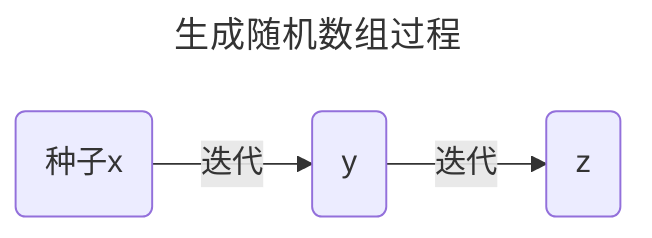

# C语言生成随机数

- <font size=4 color=blue>**依赖的头文件:`stdlib.h,time.h`**</font>

- <font size=4 color=blue>**依赖的库函数:**`time(),srand(),rand()`</font>


## 解析随机数生成原理

```c
void srand(unsigned int x);
int rand(void);
time_t time( time_t *timer );//time_t是整形数据
//time()函数的参数传入非空指针的时候会把时间戳存储在这个指针的地址上并且返回时间戳
//如果传参是NULL则只返回时间戳
```

`srand()`函数通过传递参数`x`采用特定的随机数生成函数生成随机数组的第一个数,其中x成为随机数种子,随机数种子不同生成的随机数第一个数字就不同

如果x相同,生成的随机数组是完全一样的:x-->带入随机数生成函数传参-->y-->再带入随机数生成函数传参-->z迭代生成随机数组



**这里X是传参的数,而y是第一个生成的数并且用于迭代后面的随机数,x称为随机数种子,每一个随机数种子可以生成一个随机数数组**

在有随机数种子的前提下,每次调用`rand()`函数都会生成一个随机数,即由一个随机数种子得到一个随机数数组,但是需要注意的是,如果随机数种子相同,通过随机数生成函数迭代生成的随机数数组是同一个,所以如果需要运行程序每次生成的随机数组随机,我们需要给`srand()`参数传递随机数,这个时候时间戳函数`time()`起作用了,`time()`可以将当前时间转换为一串数字,每次运行程序的时候时间都不同,从而生成的时间戳都不同,近似可认为`srand`传递的参数是随机数

```c
srand((unsigned)time(NULL));//随机数种子生成随机数数组
```

但是这个方法有一个缺点,因为是用时间传参,相邻两个时间戳相差不大,会导致相邻的随机数种子相差不大,进而导致两个数组第一个元素(随机数种子第一次传参得到的数)很相近,但是如果需要两次运行程序问题不大,**或者在一个程序里面需要两个随机数组可以:**

```c
srand((unsigned)time(NULL));               //生成随机数组1的第一个数
Sleep(5000);
srand((unsigned)time(NULL));               //生成随机数组2的第一个数

```

==:star:需要注意:==在生成随机数组的时候不要把`srand()`放入循环,因为这样相当于每次循环的时间戳都会作为随机数种子传参得到数组的某一个元素,
但是由于时间相差太小了,导致数组是有序的(也可以理解连续时间的时间戳作为连续的随机数种子本来应该是作为很多个数组的开头,但是这里直接把开头作为一个数组了!!!)

## 这个方法生成随机数的范围

> $0-RAND\_MAX$

## 生成特定范围随机数

如果需要特定范围的随机数可以:

```c
int i=rand()%100+1   //生成1-100随机数
int i=rand()%(b-a+1)+a;//生成a-b范围随机数
```

## 例子

```c
#include<stdlib.h>
#include<time.h>
#include<stdio.h>

int main()
{
    srand((unsigned)time(NULL));   //可以隐式转化unsigned可以不用写
	for(int i=1;i<=10;i++)
    {
		printf("%d ",rand()%100+1)  //生成10个1~100的随机数
    }
	return 0;
}
```

