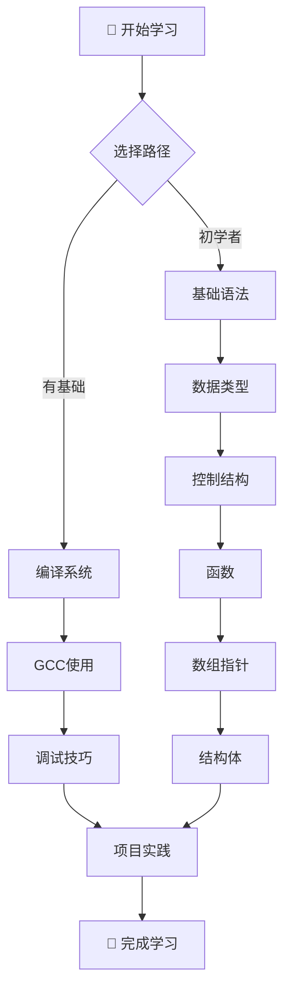
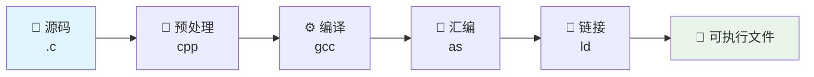

# 📚 C语言学习笔记 | C Programming Notes

<div align="center">


**一个全面、系统的C语言学习资源库**

*从基础语法到高级特性，从编译原理到调试技巧*

[📖 开始学习](#-快速开始) · [🚀 学习路径](#-学习路径) · [📁 项目结构](#-项目结构) · [🤝 贡献指南](#-贡献指南)

</div>

---

## 📋 目录

- [✨ 项目特色](#-项目特色)
- [🚀 快速开始](#-快速开始)
- [📚 学习路径](#-学习路径)
- [📁 项目结构](#-项目结构)
- [📖 核心模块](#-核心模块)
- [🛠️ 开发工具](#️-开发工具)
- [📊 项目统计](#-项目统计)
- [❓ 常见问题](#-常见问题)
- [🤝 贡献指南](#-贡献指南)
- [📄 许可证](#-许可证)

---

## ✨ 项目特色

<table>
<tr>
<td width="50%">

### 🎯 **系统化学习**
- 📝 **37+ 篇**详细文档
- 🔄 **循序渐进**的学习路径
- 💡 **实用案例**与代码示例
- 🧪 **实践项目**指导

</td>
<td width="50%">

### 🔧 **全栈覆盖**
- 📚 **基础语法**到**高级特性**
- ⚙️ **编译系统**深度解析
- 🐛 **调试技巧**实战指南
- 📖 **标准库**函数详解

</td>
</tr>
</table>

---

## 🚀 快速开始

### 🎓 适合人群

| 学习者类型 | 推荐路径 | 学习时间 |
|-----------|---------|----------|
| **🌱 初学者** | [基础语法](#基础语法) → [数据结构](#数据结构) → [实践项目](#实践项目) | 4-6周 |
| **🚀 进阶者** | [编译系统](#编译系统) → [调试技巧](#调试技巧) → [标准库](#标准库) | 3-4周 |
| **🎖️ 专家级** | [系统编程](#系统编程) → [性能优化](#性能优化) → [项目实战](#项目实战) | 2-3周 |

### 📚 推荐学习顺序



---

## 📚 学习路径

### 🌱 初学者路径 (4-6周)

<details>
<summary><b>第一阶段：语言基础 (1-2周)</b></summary>

| 主题 | 文档 | 难度 | 时间 |
|------|------|------|------|
| 🔢 运算符 | [运算符.md](./Others/运算符.md) | ⭐⭐ | 1天 |
| 🔄 控制结构 | [循环.md](./Others/循环.md) | ⭐⭐ | 2天 |
| 📝 函数设计 | [函数.md](./Others/函数.md) | ⭐⭐⭐ | 3天 |

</details>

<details>
<summary><b>第二阶段：数据结构 (2-3周)</b></summary>

| 主题 | 文档 | 难度 | 时间 |
|------|------|------|------|
| 📊 数组基础 | [数组.md](./Array&Pointer/数组.md) | ⭐⭐ | 2天 |
| 👉 指针详解 | [指针.md](./Array&Pointer/指针.md) | ⭐⭐⭐⭐ | 5天 |
| 🏗️ 结构体 | [struct.md](./Keywords/struct.md) | ⭐⭐⭐ | 3天 |

</details>

### 🚀 进阶路径 (3-4周)

<details>
<summary><b>编译与调试专精</b></summary>

| 模块 | 核心内容 | 推荐文档 |
|------|----------|----------|
| ⚙️ **编译系统** | 编译流程、GCC使用 | [编译和链接.md](./Compile/编译和链接.md) |
| 🐛 **调试技能** | GDB调试、VS调试 | [Debug.md](./Debug/Dubug.md) |
| 📚 **标准库** | stdio.h、string.h | [Headers/](./Headers/) |

</details>

---

## 📁 项目结构

```
📁 C-Notes/
├── 📚 Array&Pointer/        # 数组与指针
│   ├── 📄 数组.md
│   ├── 📄 指针.md
│   ├── 📄 const修饰指针.md
│   └── 📄 数组初始化.md
├── ⚙️ Compile/              # 编译系统
│   ├── 📄 编译和链接.md
│   ├── 📄 预处理.md
│   ├── 📄 Cmake使用教程.md
│   └── 📋 GCC指令浅析.pdf
├── 🐛 Debug/                # 调试技能
│   ├── 📄 Dubug.md
│   ├── 📄 GDB内存查看指令.md
│   └── 📄 VS调试.md
├── 📖 Headers/              # 标准库
│   ├── 📁 stdio.h/
│   ├── 📄 字符函数.md
│   ├── 📄 内存函数.md
│   └── 📄 ctype.h.md
├── 🔑 Keywords/             # 关键字
│   ├── 📄 static&extern.md
│   ├── 📄 struct.md
│   ├── 📄 typedef.md
│   └── 📄 union&enum.md
└── 📝 Others/               # 其他主题
    ├── 📄 函数.md
    ├── 📄 循环.md
    ├── 📄 动态内存分配.md
    └── 📄 文件操作.md
```

---

## 📖 核心模块

### 🌟 基础语法

<table>
<tr>
<td>

**🔢 运算符与表达式**
- [运算符详解](./Others/运算符.md)
- [操作符说明](./Others/操作符.md)

**🔄 控制结构**
- [循环控制](./Others/循环.md)
- [条件判断](./Others/函数.md)

</td>
<td>

**🔑 关键字系统**
- [存储类说明符](./Keywords/static&extern.md)
- [类型定义](./Keywords/typedef.md)
- [结构体与联合](./Keywords/struct.md)

</td>
</tr>
</table>

### 📊 数据结构

| 主题 | 文档 | 核心概念 | 应用场景 |
|------|------|----------|----------|
| **📊 数组** | [数组.md](./Array&Pointer/数组.md) | 内存连续存储 | 数据批处理 |
| **👉 指针** | [指针.md](./Array&Pointer/指针.md) | 内存地址操作 | 动态内存管理 |
| **🏗️ 结构体** | [struct.md](./Keywords/struct.md) | 复合数据类型 | 对象化编程 |

### ⚙️ 编译系统

<div align="center">



</div>

| 阶段 | 工具 | 文档 | 说明 |
|------|------|------|------|
| **预处理** | cpp | [预处理.md](./Compile/预处理.md) | 宏展开、头文件包含 |
| **编译** | gcc | [编译和链接.md](./Compile/编译和链接.md) | 语法分析、优化 |
| **构建** | cmake | [Cmake使用教程.md](./Compile/Cmake使用教程.md) | 跨平台构建 |

### 🐛 调试工具

<table>
<tr>
<td width="33%">

**🔍 VS Code**
- 图形化界面
- 断点调试
- [调试指南](./Debug/Dubug.md)

</td>
<td width="33%">

**⌨️ GDB**
- 命令行调试
- 内存分析
- [GDB指令](./Debug/GDB内存查看指令.md)

</td>
<td width="33%">

**🖥️ VS Studio**
- Windows平台
- 集成开发
- [VS调试](./Debug/VS调试.md)

</td>
</tr>
</table>

---

## 🛠️ 开发工具

### 📋 推荐环境

| 平台 | 编辑器 | 编译器 | 调试器 |
|------|--------|--------|--------|
| **🐧 Linux** | VS Code | GCC | GDB |
| **🪟 Windows** | VS Code/VS | MinGW/MSVC | GDB/VS Debugger |
| **🍎 macOS** | VS Code/Xcode | Clang/GCC | LLDB/GDB |

### 🚀 快速配置

<details>
<summary><b>VS Code + C/C++ 扩展配置</b></summary>

1. **安装扩展**
   ```
   C/C++ (Microsoft)
   C/C++ Compile Run
   Code Runner
   ```

2. **配置编译任务** - 参考 [调试指南](./Debug/Dubug.md)

3. **设置调试环境** - 详见文档说明

</details>

---

## 📊 项目统计

<div align="center">

### 📈 内容统计


</div>

| 模块 | 文档数 | 核心主题 | 学习时间 |
|------|--------|----------|----------|
| **基础语法** | 12篇 | 运算符、控制结构、函数 | 1-2周 |
| **数据结构** | 8篇 | 数组、指针、结构体 | 2-3周 |
| **编译系统** | 6篇 | GCC、CMake、链接 | 1-2周 |
| **调试技能** | 5篇 | GDB、VS Code、分析 | 1周 |
| **标准库** | 6篇 | stdio.h、string.h | 1-2周 |

---

## ❓ 常见问题

<details>
<summary><b>🤔 我是零基础，应该从哪里开始？</b></summary>

**推荐学习路径：**
1. 📖 阅读 [函数.md](./Others/函数.md) 了解基本概念
2. 🔢 学习 [运算符.md](./Others/运算符.md) 掌握基本运算
3. 🔄 理解 [循环.md](./Others/循环.md) 中的控制结构
4. 📊 进入 [数组.md](./Array&Pointer/数组.md) 学习数据结构
5. 👉 挑战 [指针.md](./Array&Pointer/指针.md) 这个重点难点

</details>

<details>
<summary><b>🔍 指针太难了，有什么好的学习方法？</b></summary>

**学习建议：**
- 🎯 **从概念开始** - 理解内存地址概念
- 🔍 **使用调试工具** - 观察指针变量的值
- 📝 **画内存图** - 手动绘制内存布局
- 🧪 **多写代码** - 从简单指针操作开始
- 📚 **结合数组** - 理解指针与数组关系

</details>

<details>
<summary><b>🛠️ 如何搭建开发环境？</b></summary>

**环境配置步骤：**
1. **安装编译器** - GCC (Linux/macOS) 或 MinGW (Windows)
2. **配置编辑器** - VS Code + C/C++ 扩展
3. **安装调试器** - GDB 或 VS Debugger
4. **参考文档** - [调试指南](./Debug/Dubug.md)

</details>

---

## 🤝 贡献指南

我们欢迎各种形式的贡献！

### 📝 如何贡献

1. **🍴 Fork** 本仓库
2. **🌿 创建** 特性分支 (`git checkout -b feature/AmazingFeature`)
3. **💾 提交** 更改 (`git commit -m 'Add some AmazingFeature'`)
4. **📤 推送** 到分支 (`git push origin feature/AmazingFeature`)
5. **🔀 创建** Pull Request

### 🎯 贡献类型

- 📖 **文档完善** - 修正错误、补充内容
- 💡 **新增示例** - 添加代码示例、实践案例  
- 🐛 **错误修复** - 修复文档中的错误
- 🌟 **功能增强** - 新增学习模块

### 📋 贡献者

感谢所有为这个项目做出贡献的开发者！

<a href="https://github.com/yourusername/C-Notes/graphs/contributors">
  
</a>

---

## 📄 许可证

本项目采用 MIT 许可证 - 查看 [LICENSE](LICENSE) 文件了解详情。

---

<div align="center">

### 🌟 如果这个项目对你有帮助，请给一个 Star！

**让我们一起构建更好的C语言学习资源** 🚀

[](https://star-history.com/#yourusername/C-Notes&Date)

---

*最后更新：2025年8月4日* | *版本：v2.1* | *维护者：[Dawn](https://github.com/hulu798)*

</div>