# 🚀 C语言学习笔记

[](https://github.com)[](https://github.com)[](https://github.com)[](https://github.com)

> 📖 **一个全面、系统的C语言学习笔记集合**  
> 🎯 **从基础语法到高级特性，从编译原理到调试技巧**  
> 🛠️ **理论与实践并重，适合各层次学习者**

---

## 📋 快速导航

- [🎯 学习路径指南](#-学习路径指南)
- [📚 核心学习模块](#-核心学习模块)
- [🔧 实用工具](#-实用工具)
- [📊 学习统计](#-学习统计)
- [❓ 常见问题解答](#-常见问题解答)

---

## 🎯 学习路径指南

### 🗺️ 整体学习策略

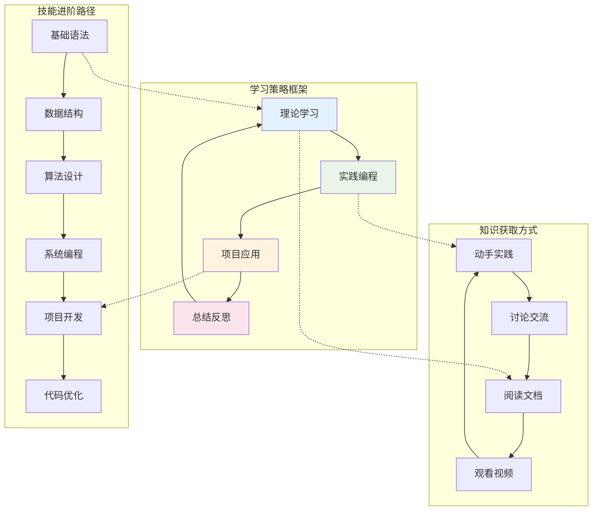

### 🌱 初学者路径 (推荐学习顺序)

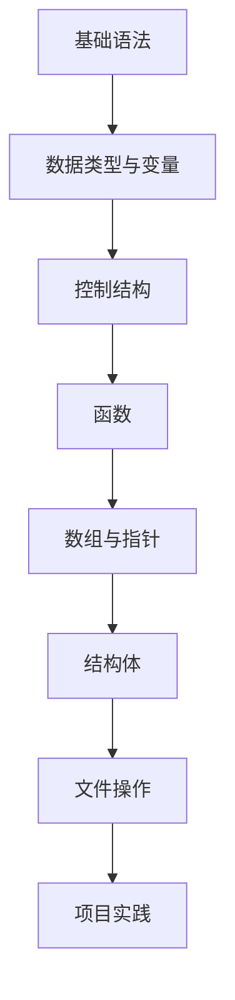

1. **第一阶段：语言基础** (1-2周)
   - [运算符](./Others/运算符.md) - 掌握各种运算符的使用
   - [循环](./Others/循环.md) - 理解循环控制结构
   - [函数](./Others/函数.md) - 学习函数的定义和调用

2. **第二阶段：数据结构** (2-3周)
   - [数组](./Array&Pointer/数组.md) - 掌握一维和多维数组
   - [指针](./Array&Pointer/指针.md) - 理解指针的概念和应用
   - [结构体](./Keywords/struct.md) - 学习复合数据类型

3. **第三阶段：高级特性** (1-2周)
   - [`static & extern`](./Keywords/static&extern.md) - 理解存储类说明符
   - [`typedef`](./Keywords/typedef.md) - 学习类型别名
   - [`union & enum`](./Keywords/union&enum.md) - 掌握联合体和枚举

### 🚀 进阶开发者路径

1. **编译系统深入**
   - [编译和链接](./Compile/编译和链接.md)
   - [`GCC`使用](./Compile/GNC-Tutorial/)
   - [`Makefile`教程](./Compile/GNC-Tutorial/3.Makefile-Tutorial/)

2. **调试技能提升**
   - [`Debug`技巧](./Debug/Dubug.md)
   - [`GDB`调试](./Debug/GDB%20内存查看指令.md)
   - [`VS`调试](./Debug/VS调试.md)

3. **标准库精通**
   - [标准输入输出函数](./Headers/stdio.h/printf处理断行.md)
   - [字符处理函数](./Headers/字符函数.md)
   - [内存管理函数](./Headers/内存函数.md)

### 🎖️ 专项技能路径

<details>
<summary>📊 <strong>系统编程专项</strong></summary>

- 内存管理深入
- 文件系统操作
- 进程间通信
- 系统调用应用

</details>

<details>
<summary>🔧 <strong>工具链专精</strong></summary>

- GCC高级用法
- Makefile进阶
- 调试工具集成
- 性能分析工具

</details>

---

## 📚 核心学习模块

### 🏗️ C语言知识体系架构

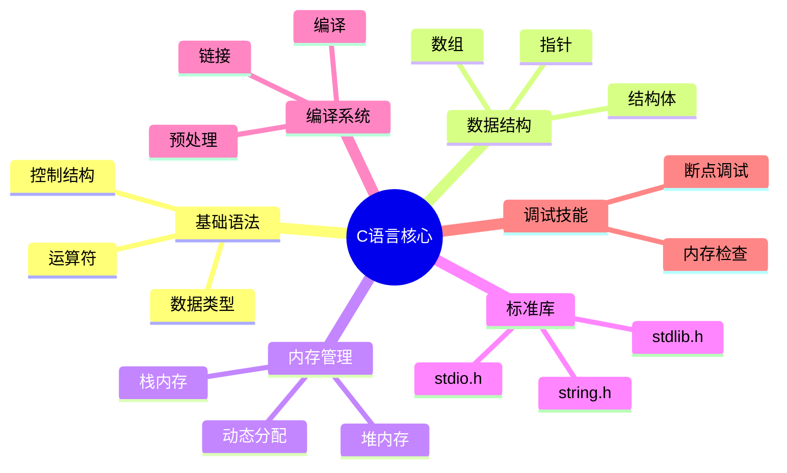

### 🔤 基础语法模块

| 主题 | 文档路径 | 难度 | 重要性 | 学习时间 |
|------|----------|------|---------|----------|
| 关键字详解 | [Keywords/](./Keywords/) | ⭐⭐ | 🔥🔥🔥 | 3-5天 |
| 运算符与表达式 | [Others/运算符.md](./Others/运算符.md) | ⭐⭐ | 🔥🔥🔥 | 2-3天 |
| 控制结构 | [Others/循环.md](./Others/循环.md) | ⭐⭐ | 🔥🔥🔥 | 2-3天 |
| 函数设计 | [Others/函数.md](./Others/函数.md) | ⭐⭐⭐ | 🔥🔥🔥 | 4-6天 |
| 动态内存管理 | [Others/动态内存分配.md](./Others/动态内存分配.md) | ⭐⭐⭐⭐ | 🔥🔥🔥 | 3-4天 |
| 随机数生成 | [Others/随机数的生成.md](./Others/随机数的生成.md) | ⭐⭐ | 🔥🔥 | 1天 |
| 代码规范 | [Others/好的代码习惯.md](./Others/好的代码习惯.md) | ⭐⭐ | 🔥🔥🔥 | 1-2天 |

<details>
<summary>📝 <strong>关键字专题</strong></summary>

#### 存储类说明符
- [`static & extern`](./Keywords/static&extern.md) - 存储期与链接性
- 应用场景：模块化编程、变量生命周期管理

#### 数据类型定义
- [`struct`](./Keywords/struct.md) - 结构体设计与应用
- [`union & enum`](./Keywords/union&enum.md) - 联合体与枚举类型
- [`typedef`](./Keywords/typedef.md) - 类型别名定义

#### 核心概念深入
- **内存管理** - 理解栈、堆、静态区的区别和使用
- **作用域与生命周期** - 掌握变量的可见性和存续时间
- **函数设计原则** - 高内聚低耦合的编程思想
- **错误处理** - 断言、返回值检查等防御性编程

#### 学习建议
- 🎯 重点理解作用域和生命周期概念
- 🔍 通过实例代码加深理解
- 💡 注意不同编译器的差异
- 🧪 多做练习巩固基础概念

</details>

### 📊 数据结构模块

| 主题 | 文档路径 | 难度 | 重要性 | 前置知识 |
|------|----------|------|---------|----------|
| 数组基础 | [Array&Pointer/数组.md](./Array&Pointer/数组.md) | ⭐⭐ | 🔥🔥🔥 | 基础语法 |
| 指针详解 | [Array&Pointer/指针.md](./Array&Pointer/指针.md) | ⭐⭐⭐⭐ | 🔥🔥🔥🔥 | 数组、内存概念 |
| 指针常量 | [Array&Pointer/const修饰指针.md](./Array&Pointer/const修饰指针.md) | ⭐⭐⭐ | 🔥🔥🔥 | 指针基础 |
| 数组初始化 | [Array&Pointer/数组初始化.md](./Array&Pointer/数组初始化.md) | ⭐⭐ | 🔥🔥 | 数组基础 |

<details>
<summary>🎯 <strong>学习重点与难点</strong></summary>

#### 🎯 学习重点与难点

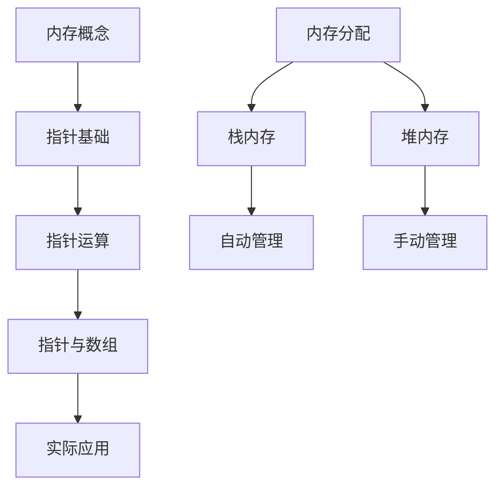

#### 内存管理生命周期

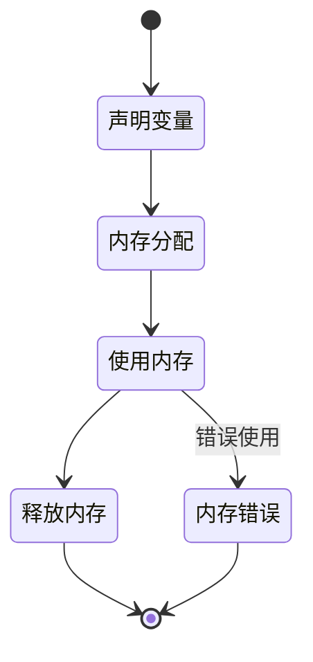

#### 指针学习路线图
```
指针概念 → 指针运算 → 指针与数组 → 函数指针 → 二级指针 → 指针应用
```

#### 关键概念突破
- **内存模型理解** - 栈、堆、静态区的区别
- **指针运算规则** - 地址计算与类型转换
- **数组退化机制** - 数组名作为指针的条件
- **const修饰规则** - 指向常量的指针 vs 常量指针

#### 实践建议
- 🔍 使用调试工具观察内存变化
- 📝 绘制内存布局图
- 🧪 编写测试代码验证概念
- 🎯 重点掌握指针与数组的关系
- ⚠️ 注意避免野指针和内存泄漏
- 📚 结合实际项目加深理解

#### 常见陷阱
- **数组越界** - 访问超出数组范围的内存
- **野指针** - 使用未初始化或已释放的指针
- **内存泄漏** - 动态分配的内存未及时释放
- **悬空指针** - 指向已释放内存的指针

</details>

### ⚙️ 编译系统模块

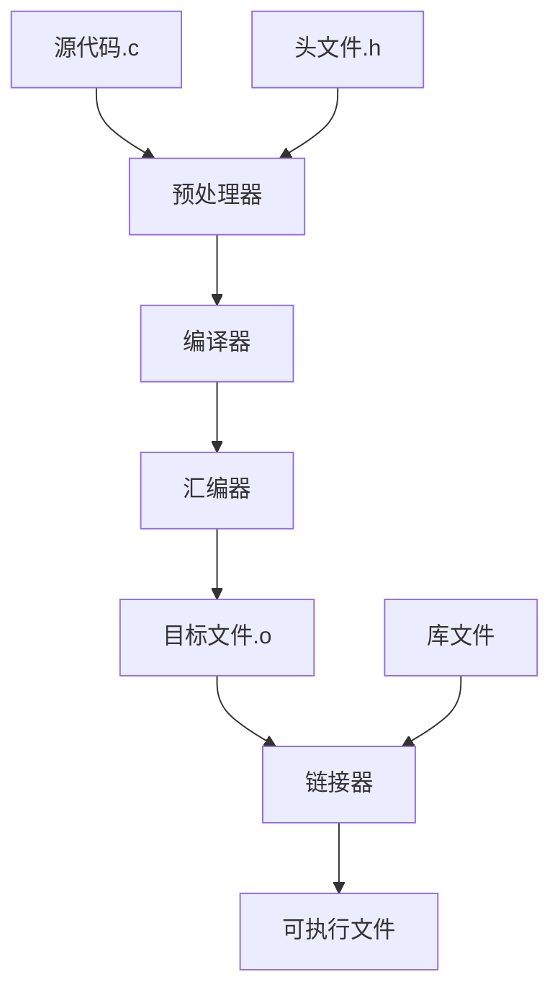

#### 编译阶段详解


| 组件 | 文档路径 | 技能等级 | 应用场景 |
|------|----------|----------|----------|
| `GCC`基础 | [Compile/GNC-Tutorial/](./Compile/GNC-Tutorial/) | 中级 | 日常编译 |
| `Makefile` | [Compile/GNC-Tutorial/3.Makefile-Tutorial/](./Compile/GNC-Tutorial/3.Makefile-Tutorial/) | 高级 | 项目构建 |
| 编译原理 | [Compile/编译和链接.md](./Compile/编译和链接.md) | 专家级 | 深度理解 |

<details>
<summary>🔧 <strong>编译工具链详解</strong></summary>
#### GCC编译流程

1. **预处理阶段** - 头文件展开、宏替换
2. **编译阶段** - 源码转汇编
3. **汇编阶段** - 汇编转目标代码
4. **链接阶段** - 目标文件合并

#### `Makefile`核心概念

- **规则定义** - 目标、依赖、命令
- **变量系统** - 自定义变量与预定义变量
- **函数应用** - 字符串处理、文件操作
- **条件语句** - 分支构建逻辑

#### 学习资源
- [📺 `GNU Makefile`编译教程](https://www.bilibili.com/video/BV1EM41177s1/)
- [📖 官方文档](https://www.gnu.org/software/make/manual/)

</details>

### 🐛 调试技能模块

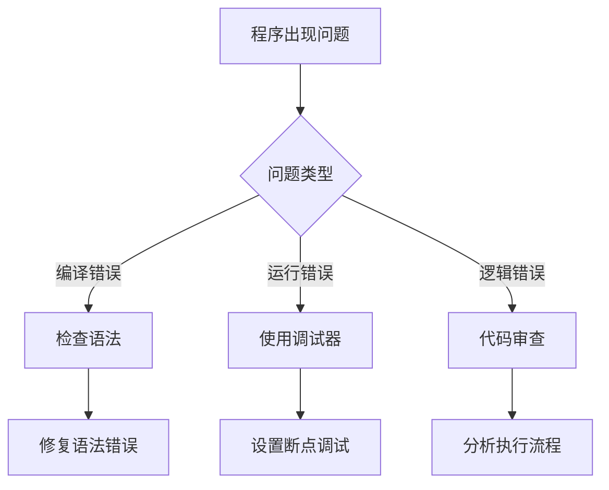

#### 调试工具选择

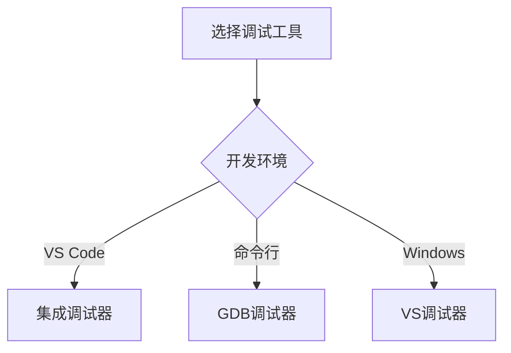

| 工具 | 文档路径 | 适用场景 | 学习曲线 |
|------|----------|----------|----------|
| `VS Code`调试 | [Debug/Dubug.md](./Debug/Dubug.md) | 日常开发 | 平缓 |
| `GDB`调试器 | [Debug/GDB内存查看指令.md](./Debug/GDB%20内存查看指令.md) | 复杂问题 | 陡峭 |
| `VS`调试器 | [Debug/VS调试.md](./Debug/VS调试.md) | Windows开发 | 中等 |

<details>
<summary>🔍 <strong>调试技能进阶</strong></summary>

#### 调试技巧层次
```
基础断点 → 条件断点 → 内存观察 → 反汇编分析 → 性能分析
```

#### 常用快捷键
- **F9** - 设置/删除断点
- **F5** - 开始调试/继续执行
- **F10** - 逐过程执行
- **F11** - 逐语句执行
- **Shift+F11** - 跳出当前函数

#### 进阶调试技术
- 内存泄漏检测
- 死锁分析
- 性能瓶颈定位
- 汇编级调试

</details>

### 📚 标准库模块

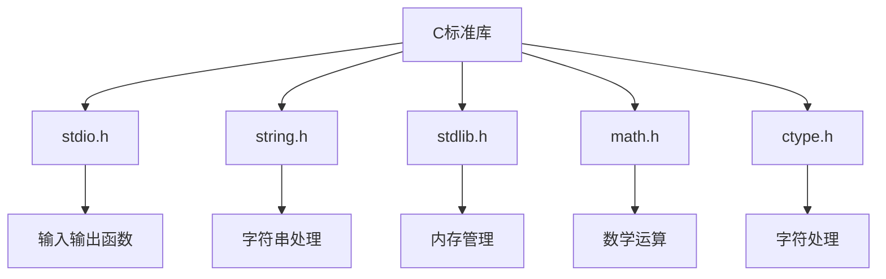

#### 函数使用频率

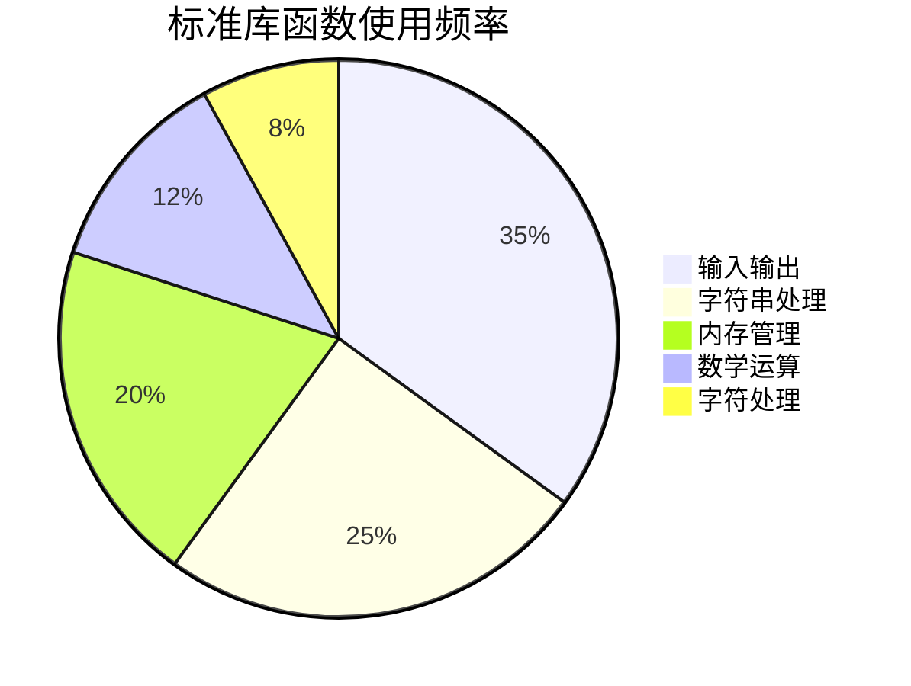

<details>
<summary>📖 <strong>标准头文件详解</strong></summary>

#### 输入输出库 (stdio.h)
- [`printf`处理断行](./Headers/stdio.h/printf处理断行.md)
- [`scanf`与空白](./Headers/stdio.h/scanf与空白.md)
- [`scanf`输入数据机制](./Headers/stdio.h/scanf输入数据机制.md)
- [`getchar()`用法](./Headers/stdio.h/getchar().md)
- [浮点数输入输出](./Headers/stdio.h/浮点数输入和输出占位符.md)

#### 字符处理库
- [字符函数大全](./Headers/字符函数.md)
- [`ctype.h`详解](./Headers/ctype.h.md)
- [`iso646.h`](./Headers/iso646.h.md)

#### 内存管理
- [内存函数](./Headers/内存函数.md)
- [动态内存分配](./Others/动态内存分配.md)

</details>

---

## 🔧 实用工具

## 🔧 实用工具

### 📈 学习进度时间线

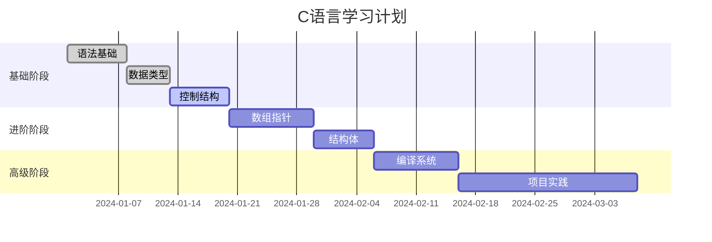

#### 学习里程碑

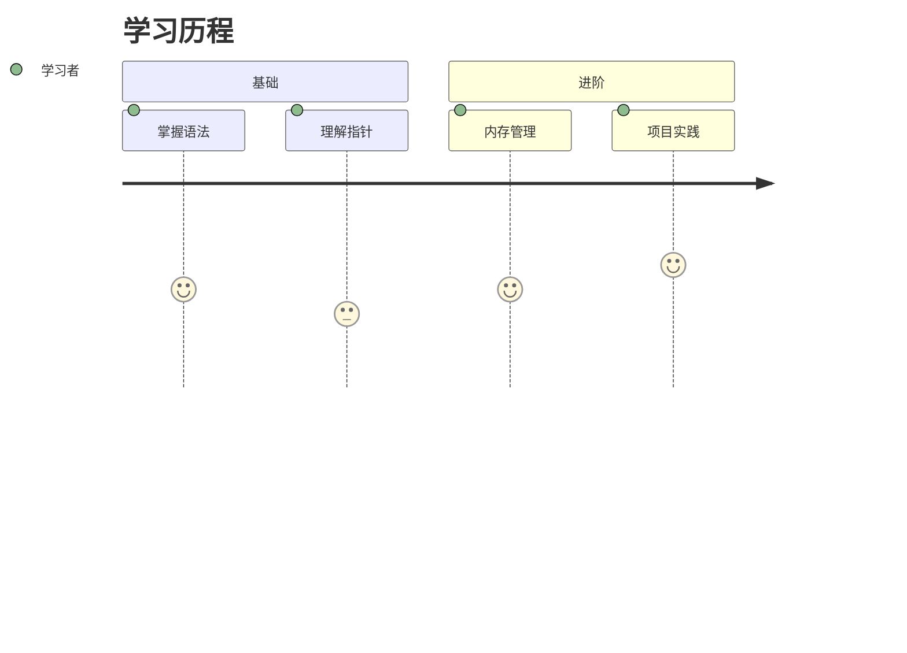

### 🔍 快速搜索指南

根据学习需求快速定位内容：

| 我想学习... | 推荐文档 | 估计时间 | 难度等级 |
|-------------|----------|----------|----------|
| 指针的基本概念 | [指针.md](./Array&Pointer/指针.md) | 2-3小时 | ⭐⭐⭐⭐ |
| 如何使用`Makefile` | [Makefile教程](./Compile/GNC-Tutorial/3.Makefile-Tutorial/) | 4-6小时 | ⭐⭐⭐ |
| 调试程序技巧 | [Debug.md](./Debug/Dubug.md) | 1-2小时 | ⭐⭐ |
| 字符串处理函数 | [字符函数.md](./Headers/字符函数.md) | 2-3小时 | ⭐⭐ |
| 结构体的使用 | [struct.md](./Keywords/struct.md) | 1-2小时 | ⭐⭐⭐ |
| 动态内存分配 | [动态内存分配.md](./Others/动态内存分配.md) | 2-3小时 | ⭐⭐⭐⭐ |
| 编译过程详解 | [编译和链接.md](./Compile/编译和链接.md) | 3-4小时 | ⭐⭐⭐⭐ |
| GCC编译器使用 | [GCC教程](./Compile/GNC-Tutorial/) | 2-4小时 | ⭐⭐⭐ |

#### 🚀 按学习目标搜索

| 学习目标 | 相关文档组合 | 建议学习顺序 |
|----------|-------------|-------------|
| **掌握基础语法** | 运算符 → 循环 → 函数 | 1周完成 |
| **理解内存管理** | 数组 → 指针 → 动态内存分配 | 2-3周完成 |
| **学会项目构建** | 编译链接 → GCC → Makefile | 1-2周完成 |
| **提升调试能力** | Debug → GDB → VS调试 | 1周完成 |
| **精通标准库** | stdio.h → 字符函数 → 内存函数 | 2-3周完成 |

### ✅ 学习检查清单

#### 基础阶段检查点
- [ ] 理解C语言的编译过程
- [ ] 掌握基本数据类型和运算符
- [ ] 熟练使用控制结构（if、for、while）
- [ ] 能够定义和调用函数
- [ ] 理解作用域和生命周期概念

#### 进阶阶段检查点
- [ ] 熟练操作指针和数组
- [ ] 理解内存分配和释放
- [ ] 掌握结构体的设计和使用
- [ ] 能够进行文件操作
- [ ] 具备基本的调试能力

#### 高级阶段检查点
- [ ] 理解编译器优化原理
- [ ] 熟练使用构建工具
- [ ] 掌握高级调试技巧
- [ ] 能够阅读和分析汇编代码
- [ ] 具备系统级编程能力

### 🎯 实践项目建议

<details>
<summary>🔰 <strong>初级项目</strong></summary>

1. **计算器程序** - 基本运算、控制结构
2. **学生成绩管理** - 数组、结构体、文件操作
3. **简单文本编辑器** - 字符串处理、文件I/O
4. **排序算法实现** - 算法逻辑、性能分析

</details>

<details>
<summary>🚀 <strong>进阶项目</strong></summary>

1. **内存池管理器** - 动态内存、指针操作
2. **简单Shell** - 系统调用、进程管理
3. **网络聊天程序** - 套接字编程、并发处理
4. **小型数据库** - 文件系统、数据结构

</details>

---

## 📊 学习统计

### 📋 内容统计

- **总文档数**: 30+ 篇
- **核心模块**: 5 个
- **学习路径**: 3 条
- **实践项目**: 8+ 个
- **代码示例**: 100+ 个

### 🎯 学习建议

| 学习阶段 | 建议时间投入 | 重点关注 | 实践比例 |
|----------|-------------|----------|----------|
| 初学者 | 每日2-3小时 | 基础概念理解 | 40% |
| 进阶者 | 每日1-2小时 | 深度应用实践 | 60% |
| 高级者 | 每周5-8小时 | 系统性掌握 | 80% |

---

## ❓ 常见问题解答

### 📂 项目结构说明

```
C语言笔记/
├── 📁 Array&Pointer/          # 数组与指针专题
│   ├── 数组.md                # 一维、多维数组详解
│   ├── 指针.md                # 指针概念与应用
│   ├── const修饰指针.md       # 指针常量与常量指针
│   └── 数组初始化.md          # 数组初始化方法
├── 📁 Compile/                # 编译系统
│   ├── 编译和链接.md          # 编译原理基础
│   ├── Cmake使用教程.md       # CMake构建工具
│   └── 📁 GNC-Tutorial/       # GCC与Makefile教程
├── 📁 Debug/                  # 调试技能
│   ├── Dubug.md              # VS Code调试技巧
│   ├── GDB内存查看指令.md     # GDB调试器使用
│   └── VS调试.md             # Visual Studio调试
├── 📁 Headers/                # 标准库函数
│   ├── 📁 stdio.h/           # 标准输入输出库
│   ├── 字符函数.md           # 字符处理函数
│   └── 内存函数.md           # 内存管理函数
├── 📁 Keywords/               # C语言关键字
│   ├── static&extern.md      # 存储类说明符
│   ├── struct.md             # 结构体
│   ├── typedef.md            # 类型别名
│   └── union&enum.md         # 联合体与枚举
└── 📁 Others/                 # 其他重要概念
    ├── 函数.md               # 函数设计与应用
    ├── 循环.md               # 循环控制结构
    ├── 运算符.md             # 运算符详解
    └── 动态内存分配.md       # 内存管理
```

### 🤔 学习中的常见问题

#### 问题解决流程

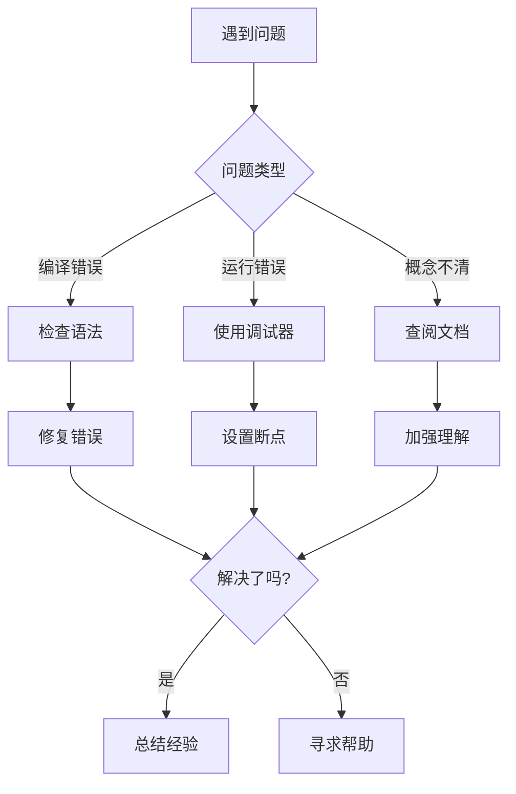

#### 错误类型分布

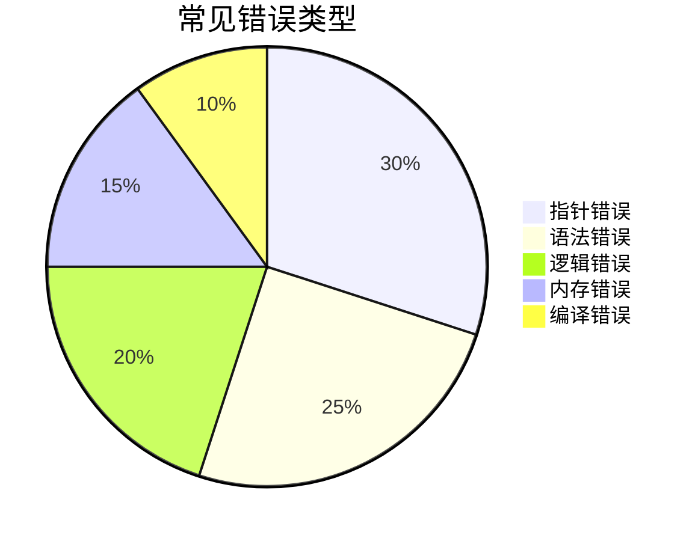

<details>
<summary><strong>Q: 我是零基础，应该从哪里开始学习？</strong></summary>

**A:** 建议按照以下顺序学习：
1. 先阅读[函数.md](./Others/函数.md)了解C语言的基本概念
2. 学习[运算符.md](./Others/运算符.md)掌握基本运算
3. 理解[循环.md](./Others/循环.md)中的控制结构
4. 然后进入[数组.md](./Array&Pointer/数组.md)学习数据结构
5. 最后挑战[指针.md](./Array&Pointer/指针.md)这个难点

</details>

<details>
<summary><strong>Q: 指针太难了，有什么好的学习方法？</strong></summary>

**A:** 指针确实是C语言的难点，建议：
- 🎯 **从概念开始**：理解内存地址的概念
- 🔍 **使用调试工具**：观察指针变量的值和指向的内容
- 📝 **画内存图**：手动绘制内存布局加深理解
- 🧪 **多写代码**：从简单的指针操作开始练习
- 📚 **结合数组**：理解指针与数组的关系

</details>

<details>
<summary><strong>Q: 编译出现错误怎么办？</strong></summary>

**A:** 编译错误处理步骤：
1. **仔细阅读错误信息**：编译器会告诉你错误位置和类型
2. **检查语法**：分号、括号、引号是否匹配
3. **检查变量声明**：是否在使用前声明了变量
4. **参考[Debug技巧](./Debug/Dubug.md)**：学习调试方法
5. **查看[GCC使用](./Compile/GNC-Tutorial/)**：了解编译器选项

</details>

<details>
<summary><strong>Q: 如何提高代码质量？</strong></summary>

**A:** 提高代码质量的建议：
- 📖 **阅读[好的代码习惯](./Others/好的代码习惯.md)**
- 🎯 **遵循命名规范**：使用有意义的变量和函数名
- 📝 **添加注释**：解释复杂的逻辑
- 🔍 **使用调试工具**：及时发现和修复问题
- 🧪 **编写测试**：验证代码的正确性
- 📚 **多读优秀代码**：学习他人的编程技巧

</details>

<details>
<summary><strong>Q: 怎样系统地学习C语言标准库？</strong></summary>

**A:** 标准库学习建议：
1. **从常用库开始**：stdio.h, stdlib.h, string.h
2. **理论结合实践**：边学边写代码验证
3. **参考官方文档**：查阅权威资料
4. **查看本笔记的[Headers目录](./Headers/)**：系统学习各种库函数
5. **做项目应用**：在实际项目中使用学到的函数

</details>

### 🛠️ 开发环境设置

<details>
<summary><strong>推荐的C语言开发环境</strong></summary>

#### 编辑器/IDE选择
- **VS Code** + C/C++ 扩展 (推荐新手)
- **Visual Studio** (Windows开发)
- **CLion** (功能强大，付费)
- **Code::Blocks** (免费，跨平台)

#### 编译器安装
- **Windows**: MinGW-w64 或 Visual Studio Build Tools
- **Linux**: GCC (通常预装)
- **macOS**: Xcode Command Line Tools

#### 调试工具
- **GDB**: 命令行调试器
- **VS Code调试**: 图形化调试界面
- **Valgrind**: 内存检查工具(Linux/macOS)

</details>

### 📚 学习资源推荐

#### 在线资源
- 🌐 **[cppreference.com](https://en.cppreference.com/w/c)** - C语言权威参考
- 📺 **[本项目配套视频](https://www.bilibili.com/video/BV1EM41177s1/)** - Makefile教程
- 📖 **[GNU官方文档](https://www.gnu.org/software/make/manual/)** - Make工具文档

#### 经典书籍
- 📚 **《C程序设计语言》** - K&R (必读经典)
- 📚 **《C和指针》** - Kenneth Reek
- 📚 **《C陷阱与缺陷》** - Andrew Koenig
- 📚 **《C专家编程》** - Peter van der Linden

#### 实践平台
- 💻 **LeetCode** - 算法练习
- 💻 **牛客网** - 编程练习
- 💻 **GitHub** - 开源项目学习

---

<div align="center">

### 🎯 开始你的C语言学习之旅！

**选择适合你的学习路径，一步步掌握C语言的精髓**

[🌱 我是初学者](#-初学者路径-推荐学习顺序) | [🚀 我要进阶](#-进阶开发者路径) | [🎖️ 专项技能](#-专项技能路径)

---

*最后更新：2025年7月4日*  
*内容版本：v2.0*  
*文档状态：持续完善中*

</div>

